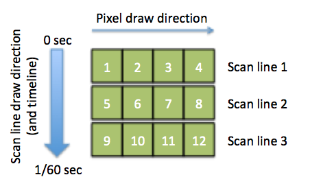
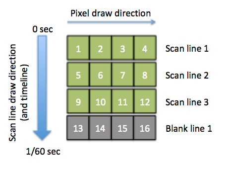
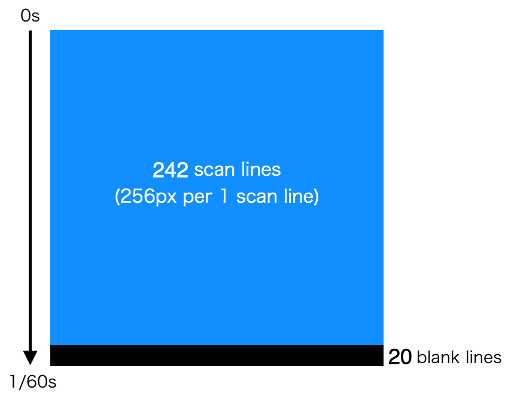
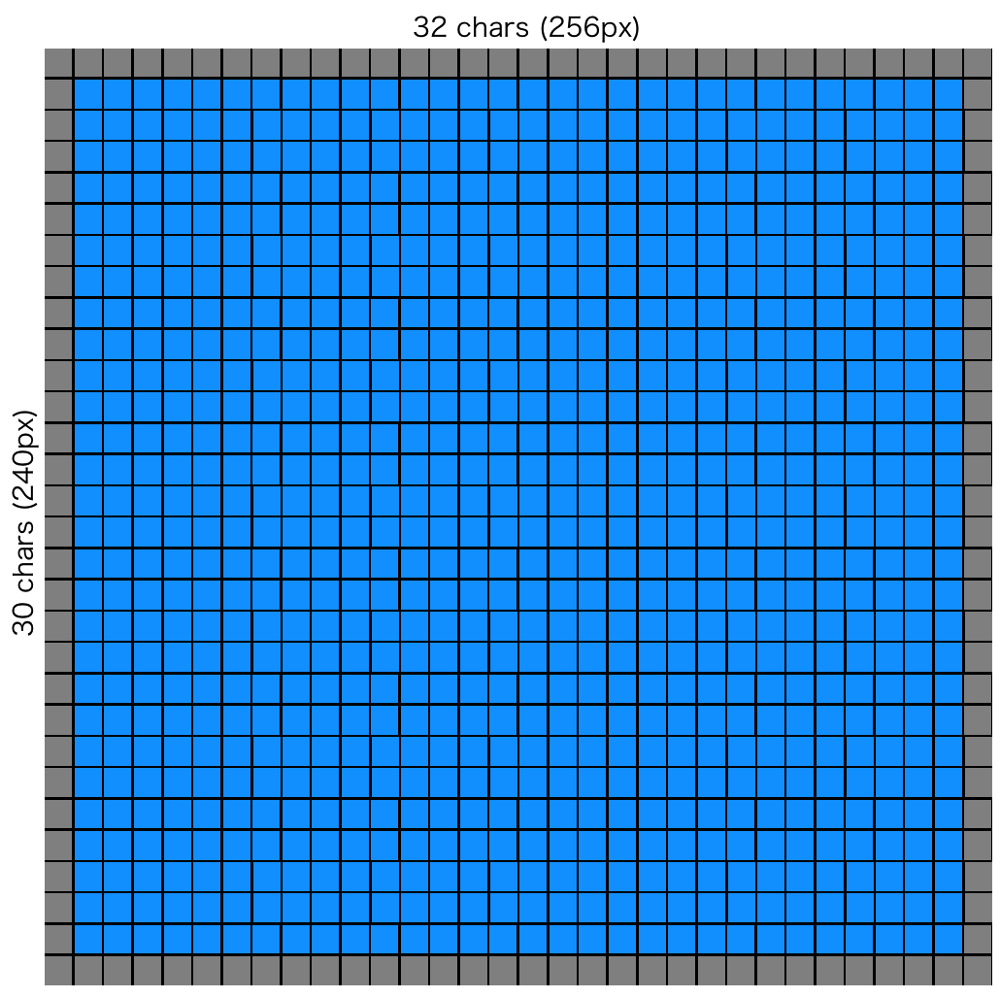
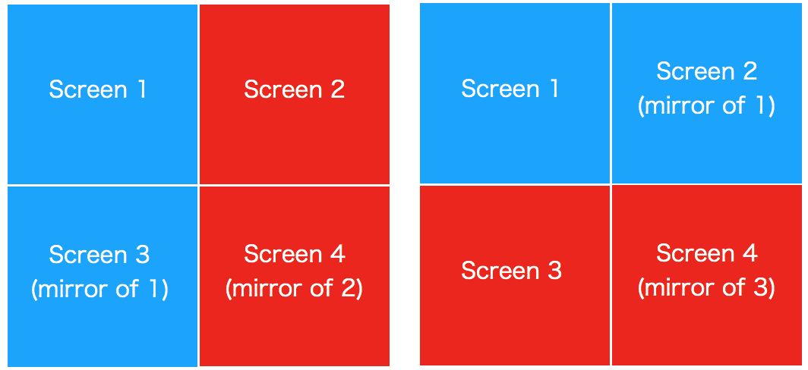
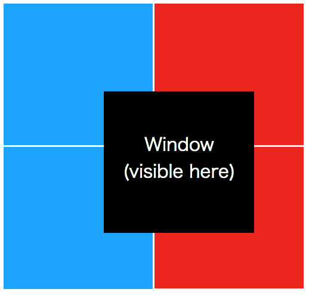
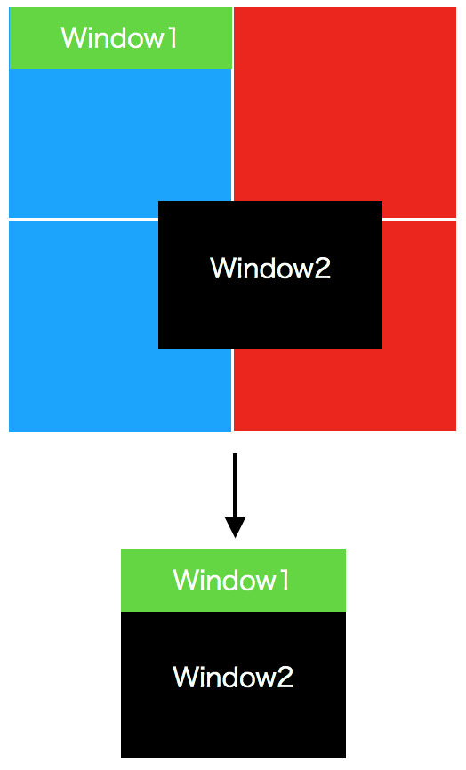
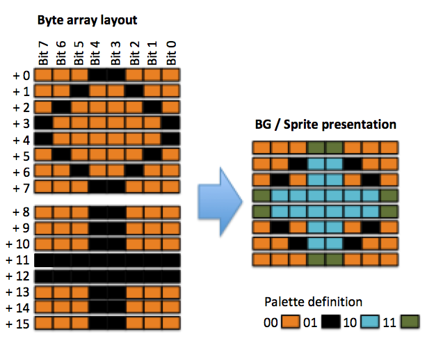
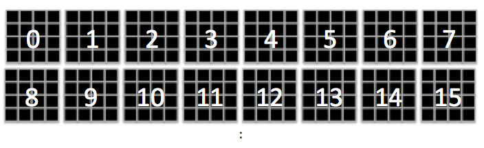
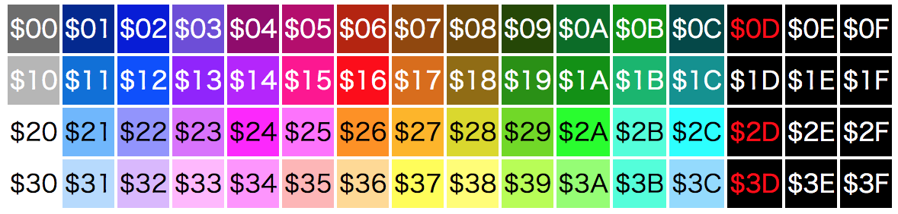

# 6502マシン語ゲームプログラミング

昨年（2018年）末、会社から少し長めの年末年始休暇を頂いたものの特に用事もなかったので、暇つぶしにファミコンゲームの開発方法を独学で習得して、[COSMIC SHOOTER](https://github.com/suzukiplan/stg-for-nes)と[BATTLE MARINE](https://github.com/suzukiplan/battle-marine-fc)という２本のゲームを開発しました。

ファミコンのハードウェアは既に解析し尽くされていて、Web上に解説情報が多く存在しますが、リファレンスとして有用なものや断片的なものは多くある反面、本のように一気通貫且つ体系的に解説されたものが見当たりませんでした。そういった情報を発信するのであれば、Webよりも本の方が適しています。しかし、テーマ的に出版が難しい内容なので、残念なら本はありません。（同人誌ならあるかもしれませんが）

そこで、私が実際にファミコンゲームを開発する過程で得られた知見を元に、そのプログラミング技法を可能な限り網羅的且つ体系的に解説を試みることにしました。本書を一通り読むことで、プログラマなら誰でもファミコン用ゲームを開発できるようになることを目指します。

> ただし、あまりにも初歩的な内容を細かく説明すると文書量が膨大になって読み難くなってしまうため、目安として情報処理技術者試験のLv2（基本情報処理技術者試験）合格程度の知識レベルがあることを前提に解説します。

## Agenda

本書は、「基礎編」「実践編」「リファレンス編」の3編構造になっています。

最低限「基礎編」「実践編」だけ学習すれば、「ファミコンのプログラミングができるプログラマ」になれます。「リファレンス編」の内容は全部覚える必要が無く、プログラミング時に必要に応じて調べれば良い内容ですが、リファレンス編の内容を全部覚えきることができれば、「ファミコンの基本ハードウェア仕様を隅々まで理解したプログラマ」にクラスチェンジすることができます。

そのため、まずは「基礎編」「実践編」の内容をじっくり学習し、「リファレンス編」の内容は流し読みするか、実際にプログラムを書きながら必要に応じて参照することで、効率的にファミコン・プログラミングの技術を身につけることができます。

> _というより、リファレンス編の内容は私が実際にプログラミングしながら理解した内容なので、私自身の理解が間違っているかもしれません。なので、自ら手を動かして確認し、もしも間違っている内容があったらissueを切るなりして教えて欲しいです。（基礎編と実践編の内容は恐らく大丈夫だと思いますが、これらも基本リバースエンジニアリングしながら解析したことなので100%確実ではないかもしれません）_

### 基礎編

- (0) 数値表記
- (1) ファミコンの仕組み
- (2) 開発環境を準備
- (3) ファミコンのプログラムでできること

### 実践編

- (4) プログラミング・マニュアル

### リファレンス編

- (5) メモリマップ（主記憶）
- (6) Mapper
- (7) PPU
- (8) メモリマップ（VRAM）
- (9) スプライト
- (10) APU

# 基礎編

## (0) 数値表記

本書では、以下の数値表記を用います。

- `%1010101` : 2進数（先頭に `%` を記載）
- `12345678` : 10進数
- `$FFFF` : 16進数（先頭に `$` を記載）

> 全般的に [cc65](https://cc65.github.io/) の書式仕様に倣います。

## (1) ファミコンの仕組み

ファミコン（ファミリーコンピュータ）に限らず、パソコンやスマホなどのコンピュータ全般は大まかに、

- 入力装置
- 処理装置（演算装置+制御装置）
- 記憶装置 (主記憶装置, 補助記憶装置)
- 出力装置

の４つの装置で構成されています。

> 情報処理のテキストによっては処理装置を演算装置と制御装置に分類しているかもしれませんが、ここではそれらを纏めて処理装置と呼びます。

ファミコンの場合基本的には、

- 入力装置 ＝ コントローラ
- 処理装置 ＝ 本体（CPU/PPU/APU）
- 主記憶装置 ＝ 本体（メモリ）
- 補助記憶装置 ＝ カセット（ROM）
- 出力装置 ＝ テレビ/スピーカ

となっています。

ファミコンにカセットを挿入して電源を投入すると、カセット内のデータ（とプログラム）がメモリ（$0000〜$FFFF）の所定の番地に読み込まれて、$8000番地からプログラムが動き始めます。そして、プログラムが動いた（処理した）結果の映像と音声がテレビとスピーカに出力されます。

## (2) 開発環境を準備

### プログラマ向け

PCはWindows、Mac、Linuxの何れでも問題なく開発できます。
開発に最低限必要なツールは以下の3つです。

- アセンブラ: [cc65](https://cc65.github.io/)
- テキストエディタ: [Visual Studio Code](https://code.visualstudio.com/download)推奨
- ファミコンエミュレータ: [VirtualNES](http://virtuanes.s1.xrea.com/)推奨

テキストエディタはソースコードを書くためのツールですが、左側にファイルのエクスプローラ、右側にテキストエディタという構成が使いやすいので、[Visual Studio Code](https://code.visualstudio.com/download)がオススメです。
誰か6502のマシン語コード入力に特化した良い感じのプラグイン作ってください。

統合開発環境は無いので、アセンブルやリンクはTerminalかMS-DOSプロンプト上で行ってください。（私はMakefileを作ってGNU makeでそれらの操作を行っていますが、この点はお好みでご自由にして頂ければ良いと思います）

ファミコンエミュレータは何でも良いのですが、WRAMをダンプできる機能があるとデバッグが捗るのでVirtualNESのチート支援機能が役立ちます。私の開発環境はMacなので、普段は[Nestopia](http://nestopia.sourceforge.net/)でテストして、どうしてもメモリダンプを見たい場面ではWineでVirtualNESを使っています。

> _イチイチWineで動かすのが面倒なので、私の方で開発者向けの機能が揃った独自エミュレータをCocoaAppで作ろうかと思っています。_

### デザイナ向け

ファミコンのグラフィックの作成をグラフィックデザイナに依頼するのは極めて難儀なことです。本当なら、デザイナも本書を呼んでファミコンのハードウェア制約を理解した上でグラフィックの描画や画面デザインを行うことが望ましいです。ただ、そうなるとデザイナ参入障壁が極めて高くなってしまい、我々プログラマが描いたショボイグラフィックだけでゲームを作らなければなりません。

[YY-CHR](http://www.geocities.jp/yy_6502/yychr/0yychr.html)というグラフィック・エディタを用いれば、デザイナでもファミコンの制約に則ったグラフィックを（半強制的に）描画することができます。

ただし、[YY-CHR](http://www.geocities.jp/yy_6502/yychr/0yychr.html)はかなりクセの強いツールで、デザイナにとってグラフィック・エディタとは手足みたいなものなので「YY-CHRで描いてください」と依頼すると「は？」と言われてしまうかもしれません。

そこで、プログラマはデザイナに以下のように依頼してみると良いかもしれません。

```
- グラフィックは3色以下の16x16（BG）または8x8（スプライト）の単位で描く
- 128x128ピクセルのサイズで2枚（BG+スプライト）納品
```

ただし、ファミコンのハードウェア制約で上記仕様だと実機では再現できいケースが（割と多く）あるので、その点は実機での動作を見ながらプログラマとデザイナで都度相談しながら作るしかありません。

## (3) ファミコンのプログラムでできること

ファミコンには、モステクノロジー社製のMOS6502というCPUをリコー社がカスタマイズしたRP2A03というCPUが搭載されています。RP2A03は6502から一部機能（デシマルモードと呼ばれる機能）を削減した上で、AY-3-8910をベースにカスタマイズしたと思しき音源モジュール（APU; Audio Porcessing Unit）をオンチップで搭載しています。つまり、「ファミコンのプログラムでできること≒6502のプログラムでできること」となります。

6502のプログラムができることは、大まかに以下の５つのことです。

- メモリの特定番地からデータをレジスタへ読み込む（load, pull）
- メモリの特定番地へレジスタのデータを記憶する（store, push）
- レジスタ間での値の入れ替え（transfer）
- 演算（足し算, 引き算, 各種論理演算, 比較）
- 分岐（branch, jump）

上記とファミコンが提供するハードウェア機能を利用してゲームの開発を行います。

次章で具体的なプログラミング方法について解説します。

# 実践編

## (4) プログラミング・マニュアル

### レジスタ

レジスタとは、CPU内部の高速な記憶装置のことで、6502には以下の6種類があります。

- a（アキュームレータ）
- x（インデックス）
- y（インデックス）
- p（ステータス）
- s（スタックポインタ）
- pc（プログラムカウンタ）

pc以外のレジスタは全て8bitで、pcのみ16bitです。

### メモリからの読み込みと記憶（load / store）

レジスタへメモリの値を読み込むことを load といい、レジスタの値をメモリへ記憶することを store といいます。そして、アキュームレータ（a）とインデックス（x/y）レジスタが load / store を直接行えるレジスタとなっています。

- `LDA` メモリの値（または即値）をaへload
- `STA` aの値をメモリへstore
- `LDX` メモリの値（または即値）をxへload
- `STX` xの値をメモリへstore
- `LDY` メモリの値（または即値）をyへload
- `STY` yの値をメモリへstore

ゲーム内で変数を扱う場合、WRAM（ユーザプログラムで自由に読み書きできる領域）の番地毎に役割を決めておき格納することになります。
オールマシン語（数値の羅列のみ）でプログラミングする場合、番地と変数の意味を対応付けて覚えておく必要がありますが、[cc65](https://cc65.github.io/)であれば、全てのメモリ番地にラベルを付けることができるので、ラベルで変数を管理できます。

> 6502のプログラミングでは、原則全ての変数をグローバル変数で管理することになるイメージでOKです。ローカル変数を持つこともできますが、6502にはスタック領域が256バイトしかないので、ローカル変数を使おうものなら、一瞬でスタックオーバーフローしてしまいほぼ何も作れなくなってしまいます。

### レジスタ間の値の転送（transfer）

aとx、aとyは相互に値を転送することができます。

- `TAX` aをxへ転送（x = a）
- `TXA` xをaへ転送（a = x）
- `TAY` aをyへ転送（y = a）
- `TYA` yをaへ転送（a = y）

結構よく使うのですが、転送方向がどっちだったのかを忘れてしまいバグを作り込むことが割とよくあります。なので、ニーモニックを正式名称で覚えることをオススメします。

- `TAX` = Transfer a to x (aをxへ転送)
- `TXA` = Transfer x to a (xをaへ転送)
- `TAY` = Transfer a to y (aをyへ転送)
- `TYA` = Transfer y to a (yをaへ転送)

### スタック（push / pull）

6502では、メモリの $0100〜$01FF番地の256バイトの領域をスタックとして使います。

16bit以上のCPUでのプログラミングに慣れていると、スタックがたったの256バイトしか無いと何もできないのではないかと思われるかもしれません。確かにC言語で関数呼び出しをすればスタックはすぐに尽きてしまいます。しかし、フルアセンブリ言語でコードを組む場合、スタックが必要な場面がかなり限られるので256バイトで十分に賄えます。

スタックへのpush（積み込み）とpull（取り出し※popと同じ意味）はアキュームレータ（a）とステータス（p）のみ対応しています。

- `PHA` aをスタックへpush
- `PLA` スタックからaへpull(pop)
- `PHP` pをスタックへpush
- `PLP` スタックからpへpull(pop)

レジスタの一時記憶をしたい場合にaをpush、演算結果のステータスを一時記憶したい場合にpをpushします。

x/yを一時記憶したい場合、以下の例のようにa経由でpush/pullします。

```
    ; assembly        C形式
    TXA             ; a = x
    PHA             ; stack[s++] = a

    ~~~ xを用いた処理を実行 ~~~

    PLA             ; a = stack[--s];
    TAX             ; x = a
```

### アキュームレータ (a)

アキュームレータ（a）は、演算することに適した8bitレジスタで、足し算、引き算、論理演算、比較といった演算命令（下記）を実行することができます。

- `ADC` 足し算 (Add with carry)
- `SBC` 引き算 (Sub with carry)
- `ORA` 論理和
- `AND` 論理積
- `EOR` 排他的論理和
- `ASL` 左シフト
- `LSR` 右シフト
- `ROL` 左ローテート
- `ROR` 右ローテート
- `BIT` ビット比較
- `CMP` 比較

注意点として、インクリメント（1加算）とデクリメント（1減算）はできません。
また、キャリーを用いない加算と減算も無い点に注意する必要があります。

更に、掛け算（MUL）、割り算（DIV）、剰余算（MOD）といった演算命令はそもそもありません。
それらの演算をしたい場合は、論理演算（ASL, LSR, AND）で代用します。

> CPUで掛け算（MUL）や除算（DIV）がサポートされるようになったのは、16bitコンピュータの頃からです。ただし、16bitコンピュータの頃の掛け算や割り算はものすごく遅かったので、ゲームの場合は論理演算、事務処理の場合はMUL/DIVといった形での使い分けをしていました。現在のコンピュータであれば論理演算と四則演算の速度は同じぐらいですが、FPUが進化した結果、浮動小数点数演算もかなり高速になりました。ちなみに、JavaScriptだと（ランタイムの実装にも依存しますが）数値型を基本的には浮動小数点数で管理しているエンジンが多いため、論理演算を行おうとすると整数変換が間に挟まる関係で「論理演算の方が遅い」という結果になったりします。

### インデックス (x/y)

インデックス（x/y）は、メモリを配列的にアクセスする時の添字としてよく使う8bitレジスタです。

x/yは両方ともほぼ同機能ですが、xの方がやや優遇されています。具体的には、演算処理でゼロページアクセスでサイクル数短縮したい場面ではxしか使えず、yだと非ゼロページと同等の方法でアクセスしてしまうので、ゼロページの性能面でのメリットが無くなってしまいます。

実行できる演算命令は、インクリメント、デクリメント、比較のみです。

- `INX` Xをインクリメント
- `DEX` Xをデクリメント
- `CPX` Xを比較
- `INY` Yをインクリメント
- `DEY` Yをデクリメント
- `CPY` Yを比較

インデックスの使い所を示す例として、メモリの $0300〜$030F に 255 をセットする例を示します。

```
    ; assembly        C形式
    ldx #0          ; x = 0
    lda #255        ; a = 255
loop:
    sta $0300, x    ; memory[$0300 + x] = a(255)
    inx             ; x = x + 1
    cpx #16
    bcc loop        ; if (x < 16) goto loop
```

### ステータス (p) と条件分岐（ブランチ）

ステータス（p）は条件分岐（branch）の判定に用いる8bitレジスタで、各bit毎に以下のような意味を持っています。

|bit位置|意味|補足|
|---|---|---|
|0|キャリー|演算の結果aがキャリー（桁あふれ）した場合にセット|
|1|ゼロフラグ|loadまたは演算の結果a/x/yがゼロになった場合にセット|
|2|IRQ禁止|セット時 = IRQ禁止(SEI), リセット時 = IRQ許可(CLI)|
|3|デシマルモード|ファミコンでは未使用|
|4|ブレークモード|BRK発生時にセット, IRQ発生時にクリア|
|5|予約|常にセットされている|
|6|オーバーフロー|演算の結果aがオーバーフローした場合にセット|
|7|ネガティブ|演算の結果aが負数になった場合にセット|

> __キャリー（桁あふれ）とオーバーフローの違い:__ やや判り難いですが補足しておきます。8bit数値はunsignedなら0〜255, signedなら-128〜127の範囲の数値を表現できます。unsignedでの桁あふれ(ex: `255+1=0` など) なら キャリー, signedでの期待値と異なる結果(ex: `64+64=-128` など) なら オーバーフロー になります。

キャリーについては、分岐（branch）以外にも足し算（ADC; add with carry）と引き算（SBC; sub with carry）にも影響する点に注意が必要です。この特性は、16bit以上の数値型を扱う場合には便利ですが、8bit数値で扱う場合しばしばバグの温床になります。

以下にキャリーが加算されるパターンのわかり易い例を示します。

```
    CMP #10
    BCC other_proc
    ADC #3 ; この場合carryがセットされている
```

上記コードで　`ADC #3` の結果は, `a = a + 3` ではなく `a = a + 3 + 1(carry)` となります。この例で示したケースであれば、キャリーが確実に立っていることが明確なので問題無いかもしれませんが、キャリーが立っているかが不明確な場合は `CLC` 命令を実行してキャリーをクリアしてから `ADC` を実行するのが無難です。

ステータス（p）に影響する条件分岐（ブランチ）命令には次のものがあります。

- `BEQ` ゼロフラグが 1(set) であればジャンプ
- `BNE` ゼロフラグが 0(clear) であればジャンプ
- `BCS` キャリーが 1(set) であればジャンプ
- `BCC` キャリーが 0(clear) であればジャンプ
- `BVS` オーバーフローが 1(set) であればジャンプ
- `BVC` オーバーフローが 0(clear) であればジャンプ
- `BMI` ネガティブが 1(set) であればジャンプ
- `BPL` ネガティブが 0(clear) であればジャンプ

ブランチ命令の注意点として、飛び先アドレスの指定方法が相対指定（absolute）で、8bitの範囲（-128〜127 ※0を除く）でなければならない点に気をつける必要があります。

(ex1: ブランチできない例)

```
    BCS label

    ~ 128バイト以上の命令がある ~

label:
```

(ex2: ブランチできない例)

```
label:

    ~ 129バイト以上の命令がある ~

    BCS label
```

### ジャンプ（無条件分岐とサブルーチン）

6502には、ブランチ命令（条件分岐）以外にジャンプ命令（無条件分岐）もあります。

- `JMP` 特定番地へジャンプ
- `JSR` 特定番地のサブルーチンへジャンプ
- `RTI` サブルーチンから `JSR` の次命令位置へ復帰

> 無条件分岐の飛び先アドレスは相対番地（absolute）だけでなく絶対番地を指定することもできますが、当然ながら相対番地で飛んだ方がサイクル数が短い（高速に実行できる）ので、アセンブラは飛び先ラベルと現在番地のアドレスを見て、相対番地が使える場合は相対番地で飛び、飛べない場合は絶対番地で飛ぶようにアセンブルします。

### 割り込み

本書では割り込みの解説を割愛します。

> NMIやIRQはとりあえずゲームを作ってみる段階であれば不要で、実際 [COSMIC SHOOTER](https://github.com/suzukiplan/stg-for-nes) や [BATTLE MARINE](https://github.com/suzukiplan/battle-marine-fc) では（リセット割り込みの対応処理以外）割り込みを使っていません。
> ただし、割り込みを使いこなすことで出来るようになる幅がかなり広がるのも事実です。
> まずは、割り込み無しでゲームを試作してみて、それから習得するのが良いと思います。

### I/O制御

6502には「マリオを画面に描画」みたいな命令は存在しません。

ファミコンに限らずコンピュータ全般では、I/Oポートへの入出力（I/O制御）でハードウェアと通信することで、そのハードウェアが提供する機能を実行します。ファミコンの場合、コントローラからの入力受付、PPU（映像処理装置）への映像出力指示、APU（音声処理装置）への音声出力指示をI/O制御で行います。

つまり、「マリオを画面に描画」を行いたい場合は、PPUへそういう指示を出します。

6502以外のCPU（Z80や8086など）にはI/O制御命令が存在しますが、6502では特定の主記憶（メモリ）番地へアクセスすることでI/O制御を行うことができます。

「メモリの何処の番地がどのような用途で使えるか」という情報のことを「メモリマップ」と呼び、プログラマはメモリマップ（やI/Oマップ）を参照しながら、対象ハードウェアを操作するプログラムを作成することになります。

# リファレンス編

## (5) メモリマップ（主記憶）

ファミコンのプログラムからアクセスできる主記憶装置の番地は $0000〜$FFFF までの 65536バイト（64KB）の範囲で、そのメモリマップは下表のようになっています。

|番地|用途|補足|
|---|---|---|
|$0000-$00FF|WRAM (zero page)|高速にアクセス可能なWRAM|
|$0100-$01FF|スタック|6502共通仕様|
|$0200-$07FF|WRAM (2〜7 page)||
|$0800-$1FFF|未使用|$0000-$07FFのミラー|
|$2000-$2007|I/Oポート (PPU)||
|$2008-$3FFF|未使用|$2000-$2007のミラー|
|$4000-$401F|I/Oポート (APU, etc)||
|$4020-$5FFF|拡張RAM|Mapper0では使用できない|
|$6000-$7FFF|バッテリーバックアップRAM|Mapper0では使用できない|
|$8000-$BFFF|プログラムROM LOW|ROMから読み込まれる|
|$C000-$FFFF|プログラムROM HIGH|ROMから読み込まれる|

標準Mapper（Mapper0）のROMカセットの場合、バンク切り替えを行うことができないため、プログラムのROM領域は常に固定ですが、MMC3などの拡張Mapperを使うことでバング切り替えにより動的に（LOWまたはHIGHの）プログラムROMの内容を異なるプログラムROMに置き換えることができます。

## (6) Mapper

ファミコンは、カセットに特殊なチップを詰むことでハードウェアを拡張することができます。初期の頃のゲームと後期の頃のゲームで表現力に大幅な違いがあるのはこのためです。本書では、特殊なチップを詰んでいない標準構成（Mapper0）に絞って解説します。

Mapper0では、プログラムが最大32KB（16KB×2）、キャラクタデータが最大8KB（4KB×2）しか使うことができません。つまり、Mapper0のROMカセットにはたったの40KB（モノによっては24KB）のデータしか入っていません。

初期の頃のファミコンゲームは、40KBという現代のゲームのグラフィック1枚にも満たないデータの中にプログラム、グラフィック、音楽といった全てのデータが入っていたと考えると驚異的です。

> 初代スーパーマリオブラザーズはMapper0で作られているので、 __スーパーマリオブラザーズぐらいの規模感のゲームなら40KB以内で作ることができる__ といえます。なので、本書では標準構成（Mapper0）に絞った解説で十分だと考えています。

## (7) PPU

ファミコンはCPUとは別に画像処理を行うPPU（Picture Processing Unit）を搭載しています。
PPUの機能は、背景画像（BG）の描画とスプライトの描画の２つです。
そして、主記憶とは別にVRAM（Video RAM）とスプライトRAM（OAM; Object Attribute Memory）呼ばれる2つのメモリ空間があります。

PPUへのアクセスは、主記憶の $2000~$2007番地（と$4013番地）への load / store により実現します。

### $2000 (Basic settings / store only)

> __PPUの基本設定__ を行う書き込み（出力）専用のI/Oポート

usage:

```
    LDA #%VPHBSINN
    STA $2000
```

- `NN:` メインスクリーン `(00: $2000, 01: $2400, 10: $2800, 11: $2C00)`
- `I:` VRAM入出力時のアドレス変化値 `(0: +1, 1: +32)`
- `S:` スプライトのキャラクタテーブル番号 `(0: $0000, 1: $1000)`
- `B:` BGのキャラクタテーブル番号 `(0: $0000, 1: $1000)`
- `H:` スプライトのサイズ `(0: 8x8, 1: 8x16)`
- `P:` PPU type `(0: master, 1: slave)`
- `V:` vBlank発生を割り込みで検出 `(0: off, 1: on)`

### $2001 (Mask settings / store only)

> __画面表示の設定__ を行う書き込み（出力）専用のI/Oポート

usage:

```
    LDA #%BGRSBMmC
    STA $2001
```

- `B:` 青を強調表示 `(0: off, 1: on)`
- `G:` 緑を強調表示 `(0: off, 1: on)`
- `R:` 赤を強調表示 `(0: off, 1: on)`
- `S:` スプライト表示 `(0: off, 1: on)`
- `B:` BG表示 `(0: off, 1: on)`
- `M:` 左端8x8のスプライト表示 `(0: off, 1: on)`
- `m:` 左端8x8のBG表示 `(0: off, 1: on)`
- `C:` モノクロ表示 `(0: color, 1: mono)`

### $2002 (Drawing status / load only)

> __画面描画の状態取得__ を行う読み取り（入力）専用のI/Oポート

usage:

```
    STA $2002 ; A = #%VSN.....
```

- `V:` vBlankの発生状態 `(0: 描画中, 1: vBlank中)`
- `S:` 0番スプライトの描画 `(0: 未検出, 1: 検出)`
- `N:` 描画ラインのスプライト描画上限 `(0: 8以下, 1: 9以上)`

ブラウン管テレビは、走査線（scan line）と呼ばれる仕組みで 一般的には1/60秒の周期（60Hz）で上から下に書けて1行づつ線（スキャンライン）を描画しています。更に細かく補足すると、スキャンラインは左から順番にピクセル単位で描画を行っています。

例えば、横4px縦3pxの画面であれば、下図のように描画されます。



また、ファミコンの場合、画面の下の方に見えないラインが存在しており、この見えないラインを描画している期間のことを vBlank と呼びます。

下図に横4px縦3pxの画面に1行のvBlankがある場合の例を示します。



ファミコンは、スキャンライン240本（各256px）、vBlankが16本という画面構成になっています。そして、スキャンライン描画中（vBlank描画期間外）にPPUメモリ（VRAM+OAM）の更新を行うと描画内容に乱れが生じる仕様なので、vBlank描画タイミングをチェックするために V を参照します。



ゲームのメインループ処理は、画面更新の間隔に併せて1ループを1/60秒で実行する必要がありますが、スキャンライン描画の期間中に行う「主記憶更新ブロック」とvBlank描画の期間中に行う「PPU更新ブロック」の2ブロックに分割してプログラミングすることになります。

> なお、実際のファミコンソフトには、S（0番スプライトの描画タイミング）をチェックすることでメインループの処理を3ブロックに分割しているものが多くあります。この点については $2005 (Window) の解説時に詳しく説明します。

### $2003~$2004 (Sprite)

> __スプライトRAM (OAM)__ への入出力を行うI/Oポート

$2003 への store でスプライトRAM (OAM) のアクセス先アドレスを設定して $2004 への load / store でOAMへの入出力を行いますが __このI/Oポートは実用上の理由でほぼ使いません。__

> スプライトに関しては「(9) スプライト」でより詳しい解説を行うので、ここでの解説は省略します。

### $2005 (Window position / store only)

> __BGのスクリーン表示位置（Window）__ の設定を行います。

> NesDev.comやその他のサイトでは、$2005のことを「スクロール」と呼んでいますが、Window (画面の表示範囲) と覚えた方がわかり易いかと思います。（実現できる機能はスクロールで間違いありませんが）

usage:

```
    LDA X座標
    STA $2002
    LDA Y座標
    STA $2002
```

$2005は上記のように2回連続で store を行う必要があり、1回目でX座標、2回目でY座標を設定します。

### Window

ファミコンの画面サイズは256x240pxで、この中にBGとスプライトが合成表示されます。

BGは、8x8の矩形を1単位（キャラクタ）として、キャラクタをタイル状に敷き詰めて表示する仕様なので __1画面 = 32x30マス = 256x240px__ となっています。



> ただし、上端8px、下端8px、左端8px、右端8px（図面上の灰色の■の部分）はブラウン管だと表示されないので、実際の __有効可視範囲は 240x224px（30x28マス）__ です。更に、上下左右16pxには重要な情報を表示してはならないという不文律がありました。つまり、有効可視範囲内であっても画面端は見切れる可能性があります。そのため、__安全可視範囲は更に狭い 224x208px (28x26マス)__ となっています。（気の利いたエミュレータは有効化可視範囲で表示する仕様のものが多いですが、256x240px全て表示してしまっているエミュレータも存在していて、256x240pxで表示しているエミュレータは画面端にノイズ情報が表示されてしまっています）

BGの画面（SCREEN）は4つあり、スクリーン・レイアウトは下図のようになります。



> 標準MAPPERの場合、図面でも示していますが画面4つ中2つはミラーになります。そのため、4画面全てを自由に描画できる訳ではありません。水平ミラーか垂直ミラーのどちらにするかは iNESヘッダーの4byte目の第6bitで指定します。

つまり、内部座標系としては 512x480（64x60マス）の領域があり、$2005で指定した任意座標の256x240px矩形が画面への表示領域（Window）となります。



### Split window (parallax scrolling)

$2002 (Drawing status) で、スプライト番号0の描画タイミングを検出できますが、この仕様を応用して、

- スプライト0描画前のWindow位置
- スプライト0描画後のWindow位置

に異なる座標を（$2005で）指定することで、Windowを上下に分割することができます。



そして、このWindow分割のテクニックを応用することで、「Window2のみスクロールさせる」という部分的なスクロール（ラスタスクロール; parallax scrolling）が実現できます。

> なお、Window分割は走査線の描画タイミングを応用したものなので、Windowの上下分割はできますが左右分割はできません。ファミコンのゲームで画面の上か下にスコア表示領域を設けているものが多く、画面の右か左にスコア表示領域を設けているものがあまりないのはこのためです。（ギャラガや拙作のCOSMIC SHOOTERでは画面を左右分割していますが、それらはWindow分割ではなく単純に1枚のWindowで処理しています）

### $2006~$2007 (VRAM access)

> __VRAM__ への入出力を行うI/Oポート

usage:

```
    LDA VRAMアドレス上位1byte
    STA $2006
    LDA VRAMアドレス下位1byte
    STA $2006
    LDA #1
    STA $2007 ; 指定アドレスに1を書き込む
```

- $2006 へ2回 store を行うことでVRAMのアクセス先番地を設定
- $2007 へ store で値を書き込む
- $2007 から load で値を読み込む
- $2007 へのアクセスの都度、アクセス先番地が +1 または +32 される
  - 加算される値は $2000 (Basic settings) の I の値に依存

VRAMへキャラクタを横書きする時は、$2006のstore 1セット(2回)だけで行い、I=0で$2007へ連続出力すれば実現できます。

> 縦書きの使い所はあまり無いかもしれません（少なくとも私は必要な場面にまだ遭遇していません）

## (8) メモリマップ（VRAM）

VRAMには $0000〜$3FFF までの16384バイト（16KB）のメモリ空間があり、メモリマップは下表のようになっています。

|番地|用途|補足|
|---|---|---|
|$0000-$0FFF|パターンテーブル0|ROMから読み込まれる|
|$1000-$1FFF|パターンテーブル1|ROMから読み込まれる|
|$2000-$23FF|ネームテーブル0|画面0のBG配置パターン|
|$2400-$27FF|ネームテーブル1|画面1のBG配置パターン|
|$2800-$2BFF|ネームテーブル2|画面2のBG配置パターン|
|$2C00-$2FFF|ネームテーブル3|画面3のBG配置パターン|
|$3000-$3EFF|未使用|ネームテーブルのミラー|
|$3F00-$3F0F|パレットテーブル0（BG）|4色パレット×4つ|
|$3F10-$3F1F|パレットテーブル1（スプライト）|4色パレット×4つ|
|$3F20-$3FFF|未使用|パレットのミラー|

### パターンテーブル ($0000-$1FFF)

パターンテーブルは、ROMから読み込まれるキャラクタデータが格納されている領域で、4096バイト（$1000バイト）のテーブル2つで構成されています。そして、1テーブルあたり、8x8ピクセル単位 の 2bitカラー のキャラクタデータ（8×2=16バイト）が 256個（16×256=4096バイト）格納されています。

下図に、1キャラクタのデータレイアウトを示します。



### ネームテーブル ($2000-$2FFF)

Windowの解説で先述した通り、ファミコンのBGは32x30マスの画面4つで構成されおり、ネームテーブルが各画面の実際の描画パターンになります。

1つのネームテーブルは、960byteのタイル領域と64byteの属性領域の以下2つの領域で構成されています。

- タイル領域: 1マス毎にキャラクタデータ（0〜255）の配置パターンを格納
  - Size = 32 × 30 = 960 byte
- 属性領域: 2x2マス毎にキャラクタデータに割り当てるパレット番号（0〜3）を格納
  - Size = 64 byte

属性領域は、1 byte につき 4x4マス (32x32px) 分のパレット番号を持っています。



しかし、1byte (8bit) で持つことが出来るパレット番号（2bit）のデータ数の上限は4つ（8÷2）までしかないため、パレット番号の情報は 2x2マス (16x16px) 単位で持つ仕様です。

属性領域 1byte のビットレイアウトは次のようになっています。

- bit 7〜6 : 左上2x2マスのパレット番号（00, 01, 10, 11）
- bit 5〜4 : 右上2x2マスのパレット番号（00, 01, 10, 11）
- bit 3〜2 : 左下2x2マスのパレット番号（00, 01, 10, 11）
- bit 1〜0 : 右下2x2マスのパレット番号（00, 01, 10, 11）

### パレットテーブル（$3F00〜$3F1F）

- BG用、スプライト用にそれぞれ パレットを4つづつ 定義します
- 1つのパレットは、4色の色番号を指定した4byteの配列です
- 色番号は $00〜$3F (下図) の中から任意の1色を選択します



- 64個の色番号がありますが、重複色が存在するため実際は52色です
- `0D` `2D` `3D` を赤字で記載していますが、これらの色を使用すると実機の種類やエミュレータの種類によって出力結果が異なるため、使用しない方が良いです

> そもそもファミコンの色はデジタルRGB出力ではないため、アナログテレビでなければ完璧な色の再現ができないらしいです。（この辺は私の専門外なので、詳しいことはよく分かりません...）

## (9) スプライト

### メモリマップ（OAM）

- スプライトは、スプライトRAM（OAM）へデータを入力することで表示します
- スプライトは、8x8px または　8x16px サイズのキャラクタで、最大64個同時に表示することができます
- OAMは、スプライト1個につき4バイトの情報を持つ256（4×64）バイトの構造体配列です

```c
struct Sprite {
    UINT8 y;            // スプライトの標示座標（Y）
    UINT8 tile;         // キャラクタ番号
    UINT8 attribute;    // 属性
    UINT8 x;            // スプライトの標示座標（X）
};

struct Sprite OAM[64];
```

tile:
- 8x8であればキャラクタテーブルのタイル番号（0〜255）を指定
- 8x16の場合: `%tttttttp`
  - t: タイル番号×2 (右隣の奇数タイルが下側に表示)
  - p: パターンテーブル（0: $0000, 1: $1000）

> 何故8x16というモードがあるのに、16x8や16x16が存在しないのか。それは、ファミコンの画面表示はアナログテレビの走査線の仕様に則って設計されていることに由来すると考えられます。1本の走査線は横方向にドットを描画していき、ファミコンはその中でBGとスプライトの合成表示を行っているため、水平方向のハードリミットが垂直方向と比べて低いことが分かります。そのため、垂直方向であれば画面の上から下まで64個のスプライトを（少し重ねて）並べても問題無く表示できるのに対して、水平方向は8個までしか並べることができない制約があります。

attribute:
- bit 7: 上下反転標示
- bit 6: 左右反転表示
- bit 5: 0ならBGの前面、1ならBGの背面に標示
- bit 4〜2: 未使用
- bit 1〜0: パレット番号

### OAMへのアクセス

OAMへのアクセスには次の2種類の方法があります。

1. I/Oポート（$2003〜$2004）によるアクセス
2. WRAMからのDMA転送

OAMへのアクセスはvBlank期間中に行わなければなりませんが、64個全てのスプライト情報をI/Oポートで入出力するのは無理があります。そこで、WRAMの内容（256バイト）を一回のI/Oポート入力でOAMへ転送するDMA転送機能を用いてアクセスします。

DMA転送をする場合、予め転送先OAMアドレスに0を設定しておき、

```
    LDA #$00
    STA $2003
```

メインループ内でWRAMのページ番号を $4014 に store します。

```
    LDA #$03
    STA $4014
```

上記のコードでは WRAM　の 3ページ（$0300）の内容がOAMに転送されます。

> __ページ番号:__ 6502のメモリ空間は $0000〜$FFFF までありますが、上位8bitのことを一般的にページ番号と呼びます。例えば、$0000〜$00FF であれば　0ページ となります。

なお、DMA転送には513〜514程度のCPUサイクルを要します。

### 水平方向の表示上限

スプライトは、水平方向に最大8個までしか表示できない制約があります。

水平方向に9個以上のスプライトを表示した場合、スプライトにチラつきが生じますが、その瞬間フレームを見てみると8個しか表示されていない（9個目以降は描画が省略されている）ことが分かります。

## (10) APU

ファミコンのAPUには、次の波形の音声を出力する機能があります。

1. 矩形波（2系統）
2. 三角波
3. ノイズ
4. DPCM

APUへのI/Oは、主記憶の $4000〜$4015 に対する store により行います。

### $4000〜$4003 (矩形波CH1)

```
    ; エンベロープ（波形パターン）の設定
    LDA #%DDLCVVVV
    STA $4000
```

- `D` : デューティー比（00: 87.5%, 01: 75%, 10: 50%, 11: 25%）
- `L` : 再生時間カウンタ（0: 無効, 1: 有効）
- `C` : 音量の固定化（0: 可変, 1: 固定）
- `V` : 音量（0〜15）

```
    ; スウィープ（周波数の変化）の設定
    LDA #%EPPPSSSS
    STA $4001
```

- `E` : スウィープ（0: 無効, 1: 有効）
- `P` : 期間（0〜7）
- `S` : シフト値（-8〜7）

```
    ; タイマー下位8bitの設定
    LDA #%TTTTTTTT
    STA $4002
    ; タイマー上位3bitと再生する長さの設定
    LDA #%LLLLLTTT
    STA $4003
```

- `T` : 周期値（0〜2047）
- `L` : 再生する長さ（0〜31）

音声の周波数（音程） `f` は `T` の値から次の式で計算できます。

```
f = CPU / (16 * (T + 1))
T = (CPU / (16 * f)) - 1
CPU = 1.789773MHz
```

### $4004〜$4007 (矩形波CH2)

設定できる値は $4000〜$4003 (矩形波CH1) と同じなので解説を省略します。

### $4008〜$400B (三角波)

```
    ; リニアカウンタの設定
    LDA #%CRRRRRRR
    STA $4008
    ; タイマー下位8bitの設定
    LDA #%TTTTTTTT
    STA $400A
    ; タイマー上位3bitと再生する長さの設定
    LDA #%LLLLLTTT
    STA $400B
```

- `C` : リニアカウンタの有効化（0: 無効, 1: 有効）
- `R` : リニアカウンタ値 (0〜127)
- `T` : 周期値（0〜2047）
- `L` : 再生する長さ（0〜31）

音声の周波数（音程） `f` は矩形波と同様 `T` から求まりますが、矩形波よりも1オクターブ低く（つまり、矩形波の周波数÷2で）発生されます。

### $400C〜$400F (ノイズ)

```
    ; エンベロープ（波形パターン）の設定
    LDA #%--LCVVVV
    STA $400C
```

- `L` : 再生時間カウンタ（0: 無効, 1: 有効）
- `C` : 音量の固定化（0: 可変, 1: 固定）
- `V` : 音量（0〜15）

```
    ; タイマー設定
    LDA #%T---PPPP
    STA $400E
    ; 再生する長さの設定
    LDA #%LLLLL---
    STA $400F
```

- `T` : タイマー設定（0: 無効, 1: 有効）
- `P` : 周期値パターン (0〜15)
- `L` : 再生する長さ（0〜31）

なお、 `P` の設定値により求まる周期値は NTSC（日本のアナログテレビで採用されていた規格)）と PAL（ヨーロッパで普及したアナログカラーテレビの規格）で微妙に異なります。

|$400E|NTSC|PAL|
|---|---|---|
|%10000000|4|4|
|%10000001|8|8|
|%10000010|16|14|
|%10000011|32|30|
|%10000100|64|60|
|%10000101|96|88|
|%10000110|128|118|
|%10000111|160|148|
|%10001000|202|188|
|%10001001|254|236|
|%10001010|380|354|
|%10001011|508|472|
|%10001100|762|708|
|%10001101|1016|944|
|%10001110|2034|1890|
|%10001111|4068|3778|

### $4010〜$4015 (DPCM)

すみません、まだ試していないので解説省略します。

以下URLで詳しく解説されているので、使いたい方はそちらを参照してください。

[https://wiki.nesdev.com/w/index.php/APU_DMC](https://wiki.nesdev.com/w/index.php/APU_DMC)

# 参考サイト

- [Nesdev Wiki](https://wiki.nesdev.com/w/index.php/Nesdev_Wiki)
- [NES研究室](http://hp.vector.co.jp/authors/VA042397/nes/index.html)
- [魔法使いの森（ファミコンの画面について）](https://www.wizforest.com/OldGood/ntsc/famicom.html)

# 商標及び登録商標

- ファミコン及びファミリーコンピュータは、任天堂株式会社の登録商標又は商標です。
- スーパーマリオブラザーズは、任天堂株式会社の登録商標又は商標です。
- ギャラガは、株式会社バンダイナムコエンターテインメントの登録商標又は商標です。
